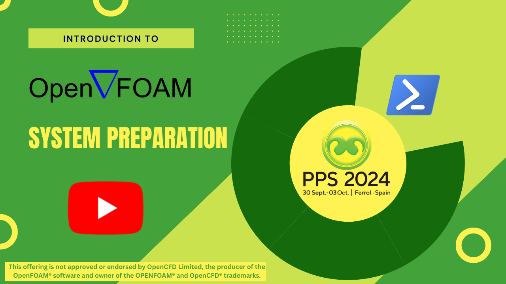

# PPS39 OpenFOAM Course
Introduction to OpenFOAM® Computational Library and Viscoelastic Fluid Flow Simulation


## 1 - System preparation

[](http://www.youtube.com/watch?v=-UVMnzBTUXg "System preparation")

Open *Windows PowerShell* as Administrator and run the following command:
```console
Enable-WindowsOptionalFeature -Online -FeatureName Microsoft-Windows-Subsystem-Linux
```
**Windows 10 users only** should also run the following command in PowerShell as Administrator:
```console
DISM /Online /Enable-Feature /All /FeatureName:Microsoft-Hyper-V
```

After each command you’ll be asked to restart the system, and you should do it.

To finalize this step open again PowerShell as Administrator and run the following command:
```console
wsl --set-default-version 2
```
---
---
## 2 - Install Windows Subsystem Linux (WSL)

[](http://www.youtube.com/watch?v=-UVMnzBTUXg "System preparation")

Run the following command in Windows *Command prompt*
```console
wsl –-install -d Ubuntu-22.04
```
---
---
## 3 - Install Visual Studio Code (VSCode)

[](http://www.youtube.com/watch?v=-UVMnzBTUXg "System preparation")

Installation website:
```console
https://code.visualstudio.com/
```
---
---
## 4 - Install Paraview 5.12

[](http://www.youtube.com/watch?v=-UVMnzBTUXg "System preparation")

Installation website: https://www.paraview.org/download/
---
---
## 5 - OpenFOAM v22.06

[](http://www.youtube.com/watch?v=-UVMnzBTUXg "System preparation")

5.1 - Add the repository
```console
curl https://dl.openfoam.com/add-debian-repo.sh | sudo bash
```

5.2 - Update the repository information
```console
sudo apt-get update
```

5.3 - install precompiled OpenFOAM v22.06
```console
sudo apt-get install openfoam2206-default
```

5.4 - To open the OpenFOAM shell session:
```console
openfoam2206
```